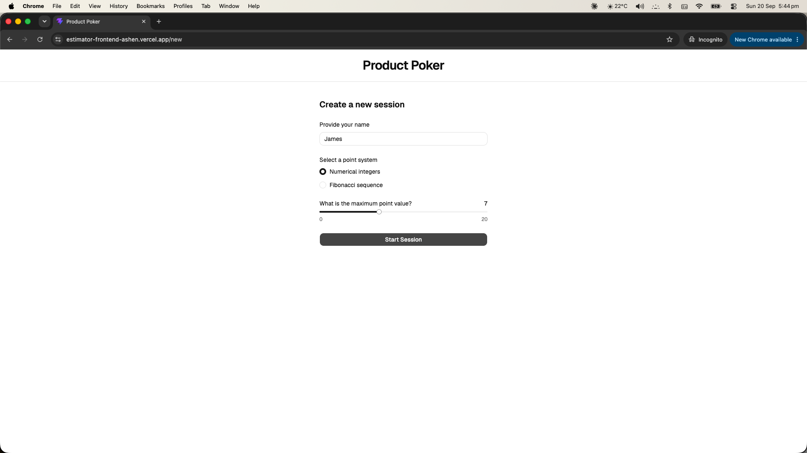
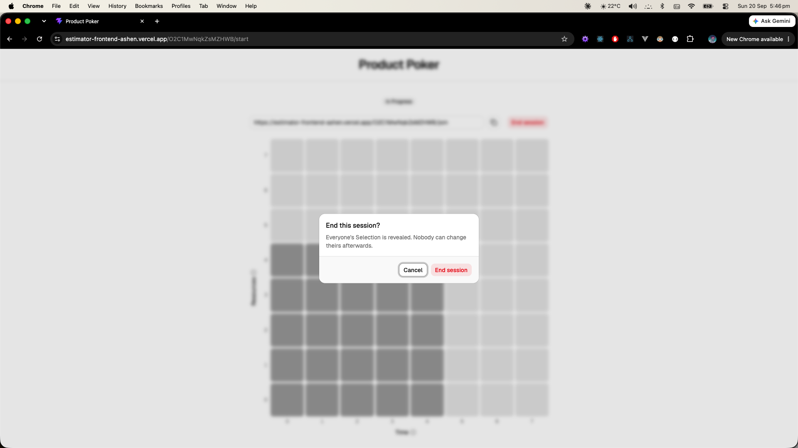
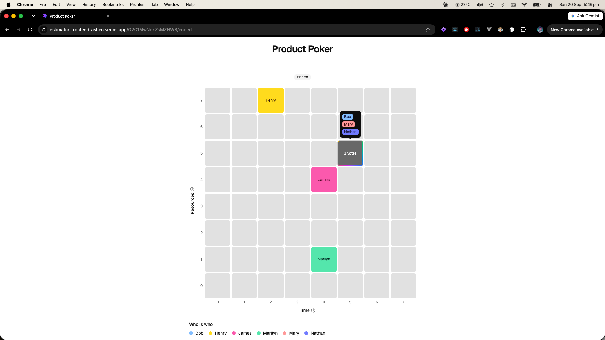
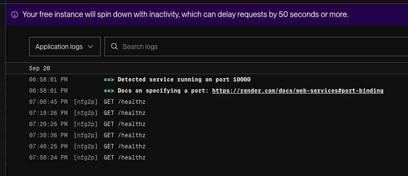

# Jira Poker frontend

Final product - [https://fold-and-flip.vercel.app/](https://fold-and-flip.vercel.app/)

Prototype version - [https://estimator-frontend-ashen.vercel.app](https://estimator-frontend-ashen.vercel.app)

This is a blind-poker application for software developers or SaaS teams to discuss tee-sizing any given feature, Jira ticket based on time and resources/complexity. This project was inspired by discussions during sprint planning sessions at work and how different team members contribute differently. I had deliberately not referred to any existing sprint planning tools or tee-shirt sizing tools on the market as this project is a personal response to a work experience. I chose the blind-poker style specifically as an unobstrusive conversation starter and platform to allow all members of the team to visibly and meaningfully contribute towards a sizing activity. Different levels of experience, personality style, involvement with a particular task can impact how sprint planning discussions proceed.

[Feedback welcomed.](http://linkedin.com/in/rachwong)

## Installation

You will require a local `.env` file with below variables:

```
PORT=3001
CORS_ORIGIN=http://localhost:5173
NODE_ENV=development
```

For running a local instance on your machine:

```
npm install
npm run dev // runs on localhost:3001

```

You will also need to run the [frontend component](https://github.com/rachelwong/estimator-frontend) as well.

To try it out locally by yourself:

1. Open a new tab on your browser of choice
2. Go to [http://localhost:5173](http://localhost:5173)
3. Create a new session
4. Copy the session link
5. Join the session (paste the link) in any number of incognito browser instances.
6. End the session and see the reveal!

## Description

This is the back-end NodeJS component to a full stack application that allows users to create sessions (stored on server side) to contribute to point-sizing a piece of work in a "blind-poker" style. This project was Claude Code assisted to explore the potential and functionalities it can offer, and how I can integrate it into my own thinking and workflows. Worth exploring would be

- DEPLOYMENT.md
- PLAN.md
- estimator-plan.md

I used spec-driven development with Claude Code. The resources that I used included:

- [Matt Pocock grilling skills](https://github.com/mattpocock/skills)
- adapted `agent.md` from [Fabien Saglard's version](https://fabiensanglard.net/agent.md/)
- Claude design skills
- impeccable and intent skills for design exploration

The estimator-plan.md was the original product plan that used MCPs to pull data from a [Notion doc](https://app.notion.com/p/rachelwong/Estimator-3bb375d34b3480548d26edd98dcc8a11?source=copy_link) and a [Miro board](https://miro.com/welcomeonboard/M3IrMjlGUzNFVDg1SXNtY2RVLzIvVDdkVUpsOUg0L1JPSVV4YTF3YThqaFJrR3pJcmdMellnK1ltcHlab3dMc1JDY0pNaVkwdTVKTElOY0NTa2wrZDVIanN5YVJXV1ZnekExWnB3elh0WFBDaVZSZUc4SkdXb0VBdEY5NkQ2YmZ0R2lncW1vRmFBVnlLcVJzTmdFdlNRPT0hdjE=?share_link_id=721456564705).

### Screenshots

<table align="center">
  <!-- First Row of Images -->
  <tr>
    <td align="center">
      <b>Welcome screen</b><br>
      
    </td>
    <td align="center">
      <b>Create Session</b><br>
      
    </td>
    <td align="center">
      <b>Active Session</b><br>
      
    </td>
  </tr>
  <!-- Second Row of Images -->
  <tr>
    <td align="center">
      <b>Join Session</b><br>
      
    </td>
    <td align="center">
      <b>Active to end session</b><br>
      
    </td>
    <td align="center">
      <b>End Session</b><br>
      
    </td>
  </tr>
</table>

## Features & Tech Stack

### Features

- routes to create, and get a session
- sessions expire on their own: 1 hour after the reveal, or 1.5 hours after an open session was last opened, joined or voted in (see `docs/features/session-ttl.md`)

### Tech stack

- Render web service (free-tier)
- NodeJS x Typescript
- Zod for request payload schema
- SocketIO

Extended the `CORS_ORIGIN` for both the final deployed project and the working prototype.

I also have to configure a cron-job every 13 minutes to keep the Render web service alive. This is because I'm on the free tier and 15 minutes of inactivity will spin down the service and require up to a 1 minute to restore. The 13-minute GET `/healthz` ping keeps the service up and running. ~~except for the period between 2am and 6am Sydney time. I am hoping that scoping down the cron-job period will help keep this within Render usage policy.~~



## Key learnings

> TL;DR not having backend experience means many of my prompts say `is this best practice`.

- managing documentation drift: monorepo approach would be better to house both front and backend
- managing usage limits: I'm currently on the lowest Claude Code Pro plan. So this [reddit advice](https://www.reddit.com/r/ClaudeAI/comments/1u7i5ow/pro_tip_reset_your_usage_limits_on_your_schedule/) is relevant: create a Claude Code Routine that runs daily, use Haiku, and just say something like "Hello, just respond with "hello"", 5 hours before you want your usage to reset
- Current process is Plan mode x grilling skills x human code review
- configuring memory.md and agents.md brings better quality and _succinct_ responses. I have found wading through paragraphs of text describing code to be a productivity tax to using something that's meant to accelerate me :shrug:.
- Plan mode and break out the work into phases. Manually review each phase and manually commit is my preferred way to go at the moment, until I can find a way to confidently gatekeep quality.
- Skills: key things that I have asked Claude Code to do in terms of code conventions were very limited by comparison:
  - avoid magic strings/numbers
- at the end of the day, AI-assisted development is faster objectively to reaching a working prototype, particularly I have gaps in knowledge in the backend and I have not built up a mental model of websockets and backend architecture as part of this exercise. Whether the code quality can stand on its own would be a question going into the future as I expand on this project and/or have opportunities to learn.

## Roadmap

Backend claude experience is very different to the frontend claude experience. I don't have much to lean on in terms of where else the backend can go, including refactoring.

[ ] Include additional notes in the payload for selection submission so that users can provide more context, ask questions as part of their estimation
[ ] Return name of the person in create session and join session response payload to display on the FE
[ ] Allow admin-users to include a text payload for every session to identify what task or feature they are currently estimating.
[ ] Ability for a participant or admin to change their estimation after the session has ended.
