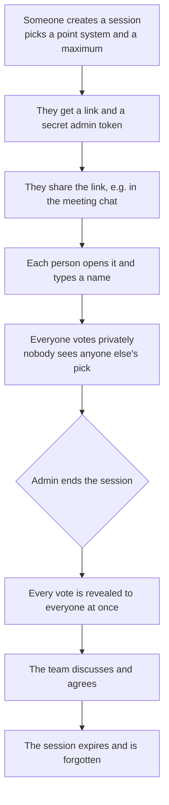
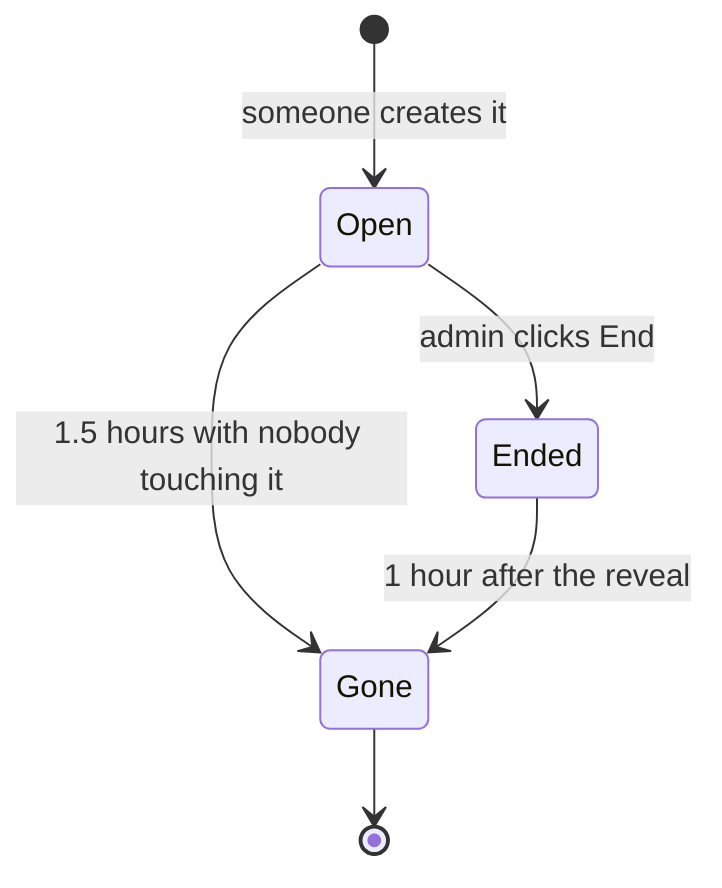
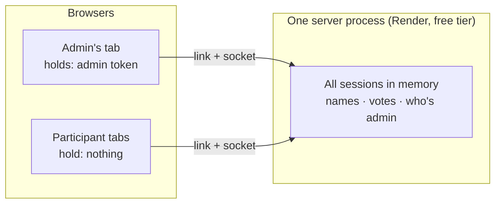
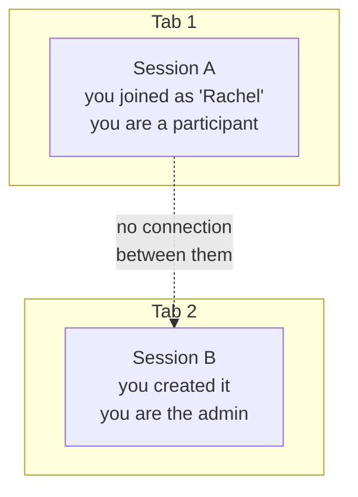

# Sessions, explained

Everything about a session in one place: what it is, how it begins and ends in a
real meeting, how long it survives, where it is kept, how many it can handle at
once, and what happens in the awkward cases.

No code walkthrough. Where a snippet makes something clearer it's there to read,
not to run.

> **Status.** This describes the behaviour once the work in
> `docs/features/session-ttl.md` has shipped. Anything not yet live is marked
> **(pending)**. When the rollout finishes, the marks come off and everything
> here should be true as written.

---

## 1. What a session is

A session is **one estimation round for one thing** — a ticket, a feature, a
piece of work. Somebody creates it, people vote privately on a grid of time
against resources, and when the admin ends it everyone sees every vote at once.
Then it's over. You don't reuse a session for the next ticket; you make another.

Three roles exist, and only two are real:

- **The admin** — whoever created the session. They hold a secret token, they're
  the only one who can end it, and they vote like everyone else.
- **Participants** — everyone who joins by opening the link and typing a name.
- There is no "observer". If you're in the session, you can vote.

## 2. What you're voting on: time and resources

Most estimation tools ask for one number. This one asks for two, and the second
one is the point of the whole thing.

**Time** is roughly "how long will this take?" — the elapsed effort of doing the
work once you know what to do.

**Resources** is roughly "how much does this take *out of us*?" — how many people
or specialisms it pulls in, how much coordination it needs, how much is unknown
or risky. Some teams read it as complexity, and that's a fair reading.

**Why split them.** A single number quietly merges two very different jobs. A
data migration might run for days but be completely understood — long, but easy.
A subtle bug touching three systems might be fixed in an afternoon by the right
two people — short, but hard. On a one-number scale both land on "5" and the
disagreement stays invisible. On a grid they land in opposite corners, and the
conversation starts by itself:

```
resources
   ▲
   │  short but hairy        long and hairy
   │  (few days, many        (the ones that
   │   unknowns, needs        quietly eat a
   │   three specialists)     sprint)
   │
   │  quick and simple       long but simple
   │  (just do it)           (migration, bulk
   │                          edit, waiting)
   └──────────────────────────────────────▶ time
```

Two people both saying "5" can now turn out to have meant completely different
things — which is exactly the misalignment sprint planning is supposed to surface.

**The numbers themselves are deliberately abstract.** They're points, not days or
person-hours. What a 5 means is whatever your team's shared sense makes it mean,
and that calibrates itself over a few sessions.

**Picking the scale.** Whoever creates the session chooses one of two, plus the
highest value on the grid:

| Scale | Values | Highest allowed |
| ----- | ------ | --------------- |
| **Numerical** | Every whole number from 0 up to the chosen maximum: 0, 1, 2, 3, 4… | 20 |
| **Fibonacci** | The classic sequence, cut off at the chosen maximum: 0, 1, 2, 3, 5, 8, 13, 21, 34, 55 | 55 |

Both axes use the same scale, so the grid is always square. Fibonacci is the
conventional choice in agile estimation for a reason worth knowing: the gaps
widen as the numbers grow, because nobody can honestly tell a 21 from a 22 — the
scale stops you pretending to a precision you don't have. Numerical suits a team
that wants a plain, evenly-spaced grid.

Zero is a real option on both axes, and a smaller maximum makes a smaller grid,
which is usually easier to read.

**A square, then, is one pair** — this much time, this much resource. Clicking it
is your estimate. Clicking the same square again clears your vote; clicking a
different one moves it. You can change your mind freely until the reveal, and
nobody sees any of it.

## 3. The word "session" means five different things

This is the single most confusing thing in the codebase, so it's worth naming
every use.

| Where you see it | What it means |
| ---------------- | ------------- |
| **An estimation session** | The product concept described above: one round of voting on one ticket. This is what the rest of this document means by "session". |
| **A session ID** | The 16-character code in the URL, like `Kq3mZp7RtW9xB2Vy`. It's how the backend finds the session and how the link is shared. Random, not guessable by typing, but not a secret either: anyone with the link can join. |
| **An admin token** | A long secret string given only to the creator, stored in their browser. It proves "I'm the admin of this session" and is re-checked every time it's used. It is not the session ID and is never in the URL. |
| **`sessionStorage`** | A browser feature, unrelated to this product. It holds data for one tab only and is wiped when that tab closes. Mentioned here only because the name collides. |
| **A socket connection** | The live wire between one browser tab and the server. One person can have several. A connection is not a session, and closing it doesn't end anything. |

A useful way to hold it: **a session is a thing the server remembers; a
connection is a wire to it; a token is proof of who you are on that wire.**

## 4. How a session runs, start to finish



In a real sprint planning meeting it looks like this:

1. Someone shares their screen, creates a session for the first ticket and pastes
   the link into the team chat.
2. Six people open it on their laptops, type their names, and see an empty grid.
3. They read the ticket, talk for a couple of minutes, and each click a square.
   **Nobody can see anybody else's square, or even who has voted.** That's the
   whole point: nobody anchors on the loudest or most senior person.
4. When everyone's ready, the admin clicks End. Every screen flips to the reveal
   at the same moment, showing who picked what and who didn't pick at all.
5. The team talks about the spread — usually the outliers are the interesting
   part — and agrees on a size.
6. Next ticket: someone creates a new session. The old one is left behind and the
   server forgets it within the hour.

## 5. The three states a session can be in



**Open.** People can join and vote. Votes are hidden. This is most of a session's
life, and usually only a few minutes of it.

**Ended.** The reveal has happened. Everyone who has the link can see the
results, but nobody can join or vote any more. Ending is permanent — there's no
reopening, and no second round in the same session.

**Gone.** The server has deleted it. The link now behaves exactly as if it never
existed: a "not found" page. This is deliberate — see *Where a session is kept*.

## 6. How long a session lasts

| Situation | How long the server keeps it |
| --------- | ---------------------------- |
| The admin ended it | **1 hour** after the reveal |
| Still open, nobody doing anything | **1.5 hours** after the last activity |

"Activity" means something a person actually did: creating the session, joining
it, voting, **or simply opening it**. That last one matters more than it sounds.
In a real meeting everyone votes in the first ten minutes and then talks for an
hour — if only votes counted, the session would be deleted mid-discussion. Because
opening counts, anyone refreshing the page, arriving late, or opening a second tab
pushes the clock back to zero.

Two things this does **not** do:

- It doesn't count someone merely *having* the tab open. The clock resets when a
  tab connects, not continuously while it sits there. A team that votes, then
  talks for two hours without anyone touching a tab, will lose the session.
- It doesn't extend an ended session. Once the reveal happens the countdown runs
  from that moment and nothing restarts it — reading the results doesn't buy
  more time.

These are the maximums, not guarantees. A deploy wipes everything sooner (see
below).

## 7. Where a session is kept

**In the memory of a single server process, and nowhere else.** There's no
database, no file, no backup. The whole thing is a list held in one running
program on Render.



What follows from that:

- **A deploy erases every live session**, for every team, at the moment it
  happens. There's no warning and no recovery. Ship changes when nobody's
  estimating.
- **Only one server can ever run.** Everyone in a session has to be talking to
  the same process, so the app can't be scaled to two machines without changing
  where sessions live.
- **Nothing is written to disk**, so nothing is left behind after a session is
  forgotten. That's a privacy feature, not an oversight: names and votes exist
  only for as long as the session does.
- **The only thing stored in a browser** is the admin's token, kept so that a
  refresh or a second tab still recognises them as the admin. Participants store
  nothing at all, which is why a refresh makes them type their name again.
- **The server no longer restarts on its own.** It used to sleep overnight, which
  quietly cleared everything. A keep-alive ping every 13 minutes now holds it
  awake around the clock, which is exactly why the time limits in section 6 had
  to be added.

## 8. How much traffic this can handle

> ⚠️ **Everything in this section is a guess.** No load test has ever been run
> against this app, and nothing here comes from watching it under real use. The
> numbers are arithmetic from the size of the data and the shape of the traffic,
> with the reasoning shown so you can judge it — they are not observations.
> Treat them as a starting hypothesis, don't quote them to anyone as capacity,
> and if a decision depends on any of it, measure first. The one thing here that
> *is* observed is that the tool works fine for a single team.

A session is tiny. Estimating: a name, an ID and a vote per person is a few
hundred bytes, so a ten-person session should be around 2–3 KB. A thousand of
them would be a few megabytes — which suggests memory is nowhere near the limit.

The real limit is more likely **live connections and the small machine they run
on**. Render's free tier gives one modest instance with a fraction of a CPU, and
each open tab holds a socket for the length of the meeting. That's reasoning
about where the ceiling probably sits, not a measured ceiling.

| Scale | Expectation (unverified) |
| ----- | ------------------------ |
| A handful of teams at once (say 10 sessions, 60 people) | Should be comfortable. This is what the tool is built for, and roughly the only scale it's been used at. |
| Tens of sessions, a few hundred people | Probably fine. The app is almost entirely idle — a few clicks per person, then one burst at the reveal. Never tried. |
| Hundreds of sessions at once | Unknown. Best guess is that the free instance strains, through socket count rather than memory. |
| Thousands, or org-wide rollout | Would need shared storage and more than one server — a different design, regardless of what a test showed. |

**If you ever need a real answer**, the things to measure are: how many
simultaneous socket connections the instance holds before latency climbs, memory
per session with a realistic number of participants, and how the reveal
broadcast behaves when many sessions end at once. Until someone does that, the
table above is a hypothesis.

Worth knowing, and this part follows from the design rather than from
measurement: traffic is **bursty but tiny**. A session generates a handful of
messages per person over several minutes, then one broadcast at the reveal. The
expensive part isn't the messages; it's holding every tab's connection open for
the whole meeting.

## 9. Edge cases, and what actually happens

**Two people use the same name.** The second becomes `Jim-1`, the third `Jim-2`.
Nobody is refused.

**Someone closes their tab before the reveal.** They stay in the session
permanently. If they'd voted, their vote still counts at the reveal. If they
hadn't, they show up as "abstained" — indistinguishable from someone who's still
watching but never picked. There's no live list of who's present, on purpose.

**Someone refreshes their tab.** They're treated as a brand new person and have
to type a name again. Their old vote stays in the session under the old name, so
a reveal can show them twice — once as their old self, once as their new one.
This is a known trade-off of not tracking identity, not a bug.

**The admin opens a second tab, or refreshes.** They're recognised as the same
admin, and their existing vote is shown rather than a blank grid. **(pending)**
A click in either tab now updates both.

**The admin closes their tab and loses their browser storage.** They can't end
the session any more, and nobody else can either. The session eventually expires
on its own. Make a new one.

**The admin clicks End twice, or from two tabs.** The second one does nothing.
No error, no second reveal.

**Someone opens the link after the session ended.** They see the results, not a
join form — until the hour runs out, after which they get "not found".

**Someone opens the link after it expired, or after a deploy.** "Not found",
with nothing to distinguish "expired" from "never existed". That's deliberate:
keeping a record of expired sessions would mean remembering exactly what we set
out to forget.

**Someone tries to vote after the reveal.** Rejected, with a message. Their vote
at the moment of the reveal is what counts.

**Someone joins in the same instant the admin ends it.** They get in, and are
immediately told the session has ended, so they land on the results. A rare race,
handled by showing them the reveal rather than an error.

**Somebody forges a request** — a made-up admin token, a square that isn't on the
grid, a vote before joining. All rejected by the server. The browser is never
trusted about who you are: identity is decided server-side when you join and
remembered for that connection only.

**A deploy lands mid-session.** Everything is lost for everyone, immediately. The
only mitigation is timing.

**The team talks for more than 1.5 hours without touching a tab.**
The session is deleted mid-meeting. Refreshing any tab during the discussion
prevents it. If this ever happens in practice, the limit is one number and can be
raised.

## 10. Being in more than one session at once

Nothing stops you. You can be a participant in one session and, in another tab,
create a second session and be its admin. This happens for real: you're
estimating with one team, and someone asks you to spin up a round for a
different ticket.



**The two don't know about each other.** Different links, different IDs,
different connections to the server, and as far as the server is concerned, two
unrelated people. Specifically:

- **Your identity is per session.** Participant in A, admin in B. Being admin of
  one gives you nothing in the other.
- **Names don't collide across sessions.** You can be "Rachel" in both. Names are
  only deduplicated within a single session.
- **Votes are entirely separate.** Clicking a square in B does nothing in A.
- **Ending B doesn't end A**, and A's reveal shows nothing about B.
- **Closing one tab doesn't disturb the other.**
- **You can be admin of several sessions at once.** Your browser keeps one token
  per session, so each one recognises you.

This also works in a *single* tab — join A, then navigate off and create B — and
the connection to A stays open in the background until you close the tab.

**Two things worth knowing:**

- **Each session's clock runs on its own.** Being busy in B does nothing for A.
  If nobody opens, joins or votes in A for 1.5 hours, A is deleted even though
  you're actively using the app in another tab. If you're parking a session while
  you deal with another, refresh its tab occasionally.
- **A second tab on the *same* session is a different story.** If you open the
  same link again and type your name, you become a *second person* — and both of
  you show up at the reveal, with whatever each had voted. The admin is the
  exception: their browser recognises them by token, so a second admin tab is
  still the same one admin, with the same vote. **(pending)** and a click in
  either admin tab now updates both.

## 11. What the reveal shows

- Every square anyone picked, and the names of everyone who picked it — so a
  square with four names is the team converging, and a lone square off to one
  side is the conversation worth having.
- A list of everyone who didn't pick anything, under "abstained". That includes
  people who left, people who never voted, and anyone who cleared their vote
  before the end.
- Nothing else. No timestamps, no vote history, no record of who changed their
  mind.

## 12. Who can see what

The product's whole premise is that nobody sees a vote until everybody does, so
it's worth being precise about who can see what, and when.

**Before the reveal, you can see your own vote and nothing else.** Not who else
has joined, not how many people are in, not who has voted and who hasn't, not
whether anyone picked the same square as you. The server doesn't merely hide this
in the interface — it never sends it. There is no message in the protocol that
would tell one person anything about another before the reveal.

**At the reveal, everyone in the session sees everything**: every name, every
square, and the list of people who didn't vote. It lands on every screen at the
same moment.

**After the reveal**, anyone with the link sees the same results, for the hour
the session survives. There's no "admin only" view — the results are as public as
the link is.

**Who can get in:**

| | Can they? |
| --- | --- |
| Anyone with the link | Yes — join with any name, no invitation, no account, no email |
| Anyone without the link | No, in practice. The ID is 16 random characters; nobody finds one by guessing |
| Anyone who can see your screen or chat | Yes, effectively — the link is all it takes |

Treat the link exactly like a video call link: not secret, but not posted
publicly either.

**The admin's token is the only real credential.** It's created with the session,
kept in the creator's browser, never appears in the URL, and is never shown to
anyone else. Whoever holds it can end the session — so someone using your unlocked
laptop could end it, and if you lose your browser storage, nobody can end it at
all.

**Things worth being honest about:**

- **The server sees everything**, because it has to. Names and votes sit in its
  memory for the life of the session.
- **They're never written to disk, and never logged.** Server logs carry error
  codes and session IDs, not names or votes.
- **Nothing is encrypted beyond the connection itself.** Traffic to and from the
  browser goes over HTTPS and secure WebSockets; the data in memory is plain.
- **There are no accounts**, so there's nothing to log out of and nothing that
  ties a session to you afterwards. The name you type is the only identity, and
  it's gone when the session expires.

## 13. Where the rules live

This document is the plain-English version and should be updated first when a
rule changes. The decisions behind the rules, with their reasoning, live in:

- `estimator-plan.md` — the numbered product decisions.
- `CLAUDE.md` — the invariants worth knowing before changing the code.
- `docs/features/session-ttl.md` — the lifetime, sync and hardening work these
  rules come from.
